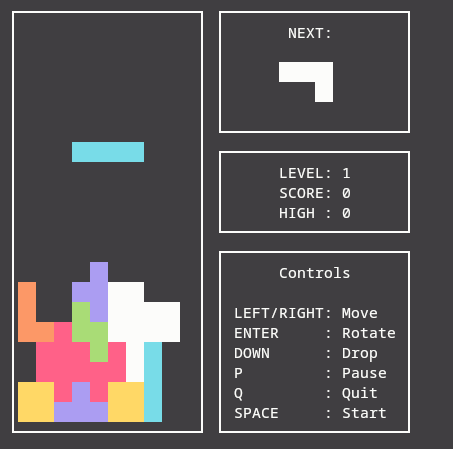

# Tetris in C

[](https://opensource.org/licenses/MIT)  
[](https://libcheck.github.io/check/)   
[](https://gcc.gnu.org/onlinedocs/gcc/Gcov.html)  
[](https://www.doxygen.nl/)  

A classic Tetris implementation in **C** with code coverage analysis, unit tests, and full documentation.



## ✨ Features

- 🎮 **Classic Tetris mechanics** (rotation, movement, hard drop)
- 📈 **Score & level system** (higher score = higher level)
- ⏱ **Dynamic difficulty** (speed increases with levels)
- 🧪 **Unit tests** (powered by [Check](https://libcheck.github.io/check/))
- 📊 **Code coverage** (generated with [gcov/lcov](https://gcc.gnu.org/onlinedocs/gcc/Gcov.html)
- 📚 **Documentation** (generated with [Doxygen](https://www.doxygen.nl/))


## 🛠️ Installation
```bash
# Install the game 
make install
```

### 🧰 Dependencies

- C compiler (GCC)
- NCurses
- *Optional*:
  - `check` (for unit tests)
  - `doxygen` (for documentation)
  - `graphviz` (for Doxygen diagrams)
  - `gcov\lcov` (for code coverage)

### 🐧🍎 Linux/macOS

```bash
# Install dependencies (Debian/Ubuntu)
sudo apt-get install libncurses5-dev libncursesw5-dev check graphviz lcov gcovr
```
```bash
# Compile & run
make
```
## 🗂️ Project Structure
```
tetris-c/  
├── brick_game/      # Source files for backend  
├── tests/           # Unit tests  
├── gcov/            # Test coverage data (autogenerated via Makefile)
├── doxygen/         # Files for generating documentation  
├── doxygen_files/   # Generated documentation (autogenerated via Makefile)
├── build/           # Folder for compiled game and tests files (autogenerated via Makefile)
├── gui/             # Source files for frontend  
├── unit_tests/      # Unit-tests for backend  
├── main.c           # Entry point for the game   
└── Makefile         # Build configuration  
```

## 🧪 Testing
Project includes unit tests using the Check framework:
```bash
# Build and run tests
make test
```

## 📊 Code coverage
Project includes code coverage test using the GCOV\LCOV:
```bash
# Generate and open coverage report
make gcov_report
```

## 📚 Documentation
Generate HTML/LaTeX docs via Doxygen:
```bash
# Generate  and open documentation
make dvi
```
## 🕹️ Keyboard Controls

- ***← →***: Move left\right
- **↓**: Instant drop (hard drop)
- **↵**: Rotate piece
- **P**: Pause game
- **Q**: Quit to menu
- **R**: Restart game

## 🔄 Development Workflow

1. Write code in ```brick_game/```
2. Add tests in ```unit_tests/```
3. Check coverage
    ```bash
    make gcov_report
    ```
4. Ensure coverage doesn't drop below 80% 

## 🤝 Contributing
1. Fork the repository

2. Create your feature branch (```git checkout -b feature/fooBar```)

3. Commit your changes (```git commit -am 'Add some fooBar'```)

4. Push to the branch (```git push origin feature/fooBar```)

5. Create a new Pull Request

## 📜 License

Distributed under the MIT License. See [LICENSE](LICENSE) for more information.


🎯 Enjoy the game! If you find this project useful, please consider giving it a ⭐!